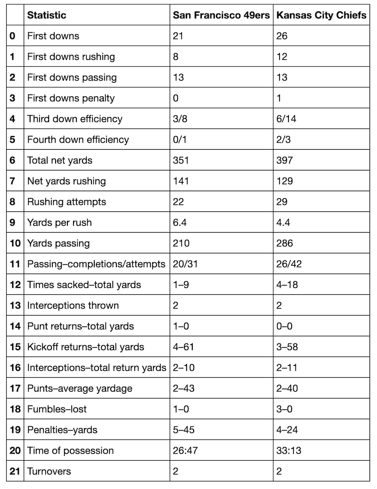
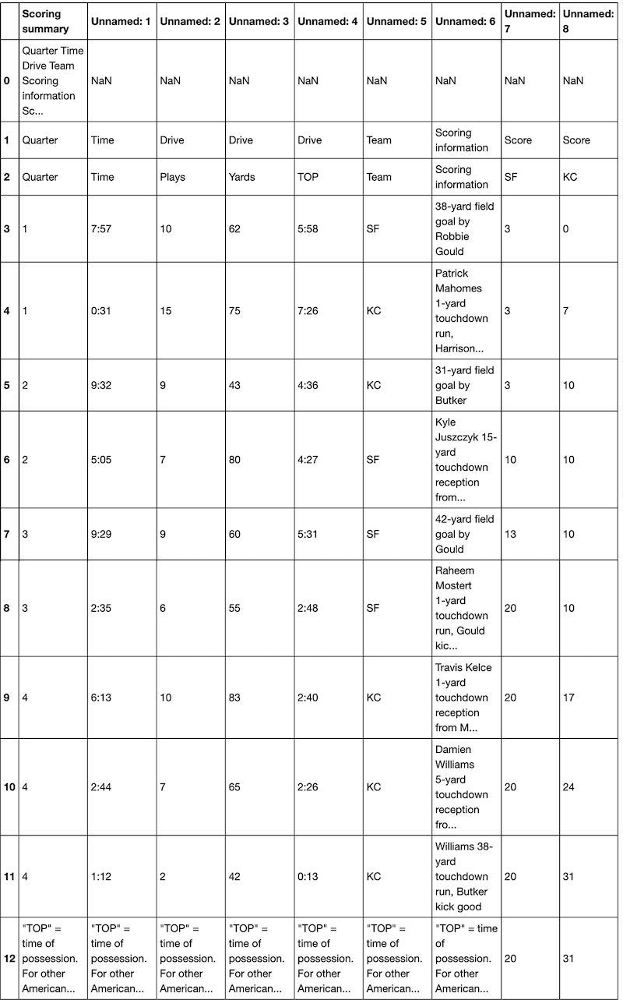
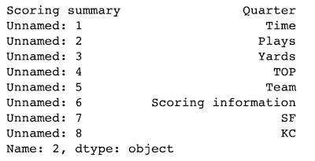
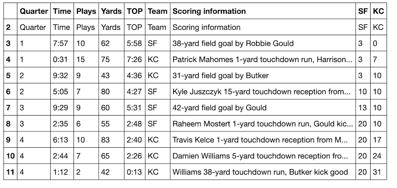
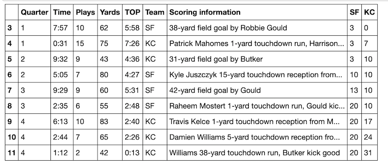
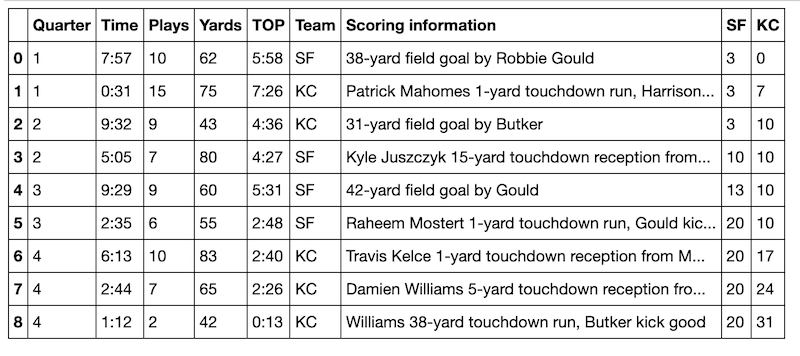

#  How to Scrape a Website with a Single Line of Python Code
## Pandas Makes Getting Table Data Easy

I've read lengthy tutorials where the authors have used libraries like urllib and BeautifulSoup and many, many steps to scrape and parse sports statistics from web pages. There's a much easier way to do it. Use Pandas.

Photo Credit: James Wheeler on Pexels.com

This tutorial covers how to pull sports statistics from Wikipedia, but the same steps can be applied to any web data that's in table form. I'll put a couple of links at the bottom for you try out.

## Let's Get Started
The Pandas library in Python includes a scraper that pulls HTML table data into a dataframe in a single step. Simply insert the URL into the `pandas.read_html()` function and assign the resulting object to a variable so you can work with it.

The catch is that this works only for text that has been put into table format in the underlying HTML. You can inspect the HTML to see if the data is in table form or just eyeball it. If it appears to be formatted in rows and columns, it's probably table data. 

Wikipedia can be a great place to use the Pandas `read_html` tool. If you're looking for something like sports statistics, you'll generally find at least one table on a page. For this tutorial, I'll scrape the Super Bowl LIV page.

     import pandas as pd
     data = pd.read_html("https://en.wikipedia.org/wiki/Super_Bowl_LIV")
     
Done! Ok, technically this is two lines, but I don't count the import statement as code.

Now we can work with the `data` object. First, let's find out how many tables it contains.

     len(data)
`24`

## Side Note
I'm working in a [Jupyter Notebook](https://jupyter.org) environment, so `print` statements aren't necessary unless I want to see multiple outputs in a single cell. Jupyter Notebooks are great for exploratory data analysis. If you're planning to do web scraping with Python, I highly recommend installing the Jupyter application. If you don't want to download it, you can use it in your browser [here](https://jupyter.org/try).

## Back to Work!
We have two options for looking through these 24 tables. One is to go look at the Wikipedia page and try to count tables to find the one we're looking for. The second, easier, option is to index `data` for a quick look.

The table at index 6 is an example of how Pandas can do a perfect one-step pull of table data. Here are the game statistics by type and team. If I want, I can export this dataframe to a .csv or assign it to a variable and keep working with it.

    data[6]
    

Sometimes (especially on Wikipedia) the table is little bit messier. Let's say I want to pull the scoring summary. That turns out to be the table at index 4.

    data[4]

This is kind of a mess. We've got some `NaN` values, the wrong header, and a weird bottom row. This particular HTML table is in a nested structure, and Pandas doesn't interpret that structure for us. We'll need to do a little cleanup.

First we'll first assign it to `df`, the standard variable for dataframe.

    df = data[4]

We don't need to use `pd.DataFrame` here because Pandas already made this into a dataframe object when we used `pd.read_html`.

The first two rows and the last row are part of that nested table structure that we don't need. We can pass a list of row numbers into the drop function to get rid of them. The default parameter for axis is 0, the row axis, so we don't need to specify it. I will anyway.

    df = df.drop([0, 1, 12], axis=0)
    df
    

This already looks a lot better. Now we  need to fix the column names. It looks like the first row would be a good candidate. Let's inspect it using `iloc`.

    df.iloc[0]
    

One thing to know about the `iloc` method is that it works by underlying index position, not by the index number or identifier that we see. If you'll notice, the top row is currently at index 2. Using `iloc` to check what row we're calling confirms that we actually need to grab what's at index 0.

In one step, we can rename the columns using the names in that top row.

    df.columns = df.iloc[0]
    df
    

Now we need to drop the first row. The `drop` method, unlike `iloc`, does not go by underlying index. It identifies what you want to drop by the name of the item. Since the first row has the index name of 2, that's what we'll put into the function to drop the row. We could add `axis=0 `as a parameter to indicate that we're dropping a row, but since that's the default, I won't bother.

    df = df.drop(2)
    df
    

The last thing to clean up is the index number. This isn't strictly necessary, but it is kind of annoying to look at. We'll use the `reset_index` method and add the parameter `drop=True`. If we don't add the `drop=True` parameter, the current (annoying) index will become a new column.

df = df.reset_index(drop=True)
df

Beautiful! We could re-name the index column, but it doesn't really bother me. 

If you know you'll be pulling lots of data in the same format, it's a good idea to make the cleanup steps into a function. Here I'll re-create the steps above, but I'll make dropping the last row its own step. By doing this, the variation in the length of scoring summaries from different football games won't matter. The function will always drop the last row.

    def score_table(table):
    """
    Returns a clean dataframe of scoring summary.
    """
        table = table.drop(len(table)-1) # Drop last row
        table = table.drop([0, 1]) 
        table.columns = table.iloc[0] 
        table = table.drop(2) 
        table = table.reset_index(drop=True) 
        return table

Let's try `score_table` with the Wikipedia page for Super Bowl LIII:

    data = pd.read_html("https://en.wikipedia.org/wiki/Super_Bowl_LIII")
    score_table(data[4])
    

It works! You can use this function to clean Super Bowl scoring summaries on Wikipedia. Be sure to double-check which table contains the scoring summary. For Super Bowl LII, it's the table at index 5. I encourage you to try it out.

So there you have it. One line of code gets you all the table data on a page. Most of the time you'll see just one table on a page and it will pull cleanly. If you need to clean it up, though, Pandas has you covered.

## One more thing:

if you're interested in scraping Wikipedia pages, Pandas is an excellent complement to Python's `wikipedia` library. With `wikipedia` you can get page text, links, and references in one easy step. What you can't get is the table data. Using both tools together will allow you to scrape anything you want from a Wikipedia page.

## Other websites to experiment with:
These websites will give you a clean dataframe using the pattern

    url = "websiteurl"
    data = pd.read_html(url)
    data[0]
    
[World Population](https://www.worldometers.info/world-population/population-by-country/)
[List of Countries in the World with Population and Land Area](https://www.worldometers.info/geography/how-many-countries-are-there-in-the-world/)
[Largest Cities in the United States (data[3])](https://www.worldometers.info/world-population/us-population/)

**Readable, but Some Cleanup Steps Required for Data Use**
[Current Weather around the World](https://www.timeanddate.com/weather/)
[List of U.S. Presidents](https://www.presidentsusa.net/presvplist.html)
[List of Holidays](https://www.timeanddate.com/holidays/us/)

## Happy scraping!
